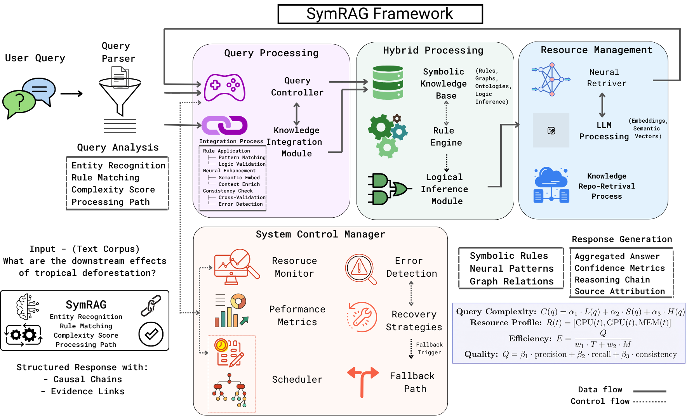

# SymRAG: Efficient Neuro-Symbolic Reasoning via Adaptive Query Routing
***Safayat Bin Hakim\***  
📄 arXiv: [2506.12981](https://arxiv.org/abs/2506.12981)

---

## 🧠 Abstract

Current Retrieval-Augmented Generation systems use uniform processing, causing inefficiency as simple queries consume resources similar to complex multi-hop tasks. We present SymRAG, a framework that introduces adaptive query routing via real-time complexity and load assessment to select symbolic, neural, or hybrid pathways. SymRAG’s neuro-symbolic approach adjusts computational pathways based on both query characteristics and system load, enabling efficient resource allocation across diverse query types. By combining linguistic and structural query properties with system load metrics, SymRAG allocates resources proportional to reasoning requirements. Evaluated on 2,000 queries across HotpotQA (multi-hop reasoning) and DROP (discrete reasoning) using Llama-3.2-3B and Mistral-7B models, SymRAG achieves competitive accuracy (97.6–100.0% exact match) with efficient resource utilization (3.6–6.2% CPU utilization, 0.985–3.165s processing). Disabling adaptive routing increases processing time by 169–1151%, showing its significance for complex models. These results suggest adaptive computation strategies are more sustainable and scalable for hybrid AI systems that use dynamic routing and neuro-symbolic frameworks.

---

## 🏗️ Repository Structure
```
symrag/  
├── data/                 # Datasets (e.g., drop_dataset_dev.json, hotpot_dev_distractor_v1.json, rules*.json)  
├── logs/                 # Log files for runs, metrics, output captures  
├── src/  
│   ├── ablation_study.py # Ablation study orchestration  
│   ├── config/           # YAML configuration files (config.yaml, ablation_config.yaml, etc.)  
│   ├── feedback/         # Feedback handling and management modules  
│   ├── integrators/      # HybridIntegrator and KnowledgeIntegrator  
│   ├── main.py           # Main pipeline runner and entry point  
│   ├── queries/          # QueryExpander and QueryLogger  
│   ├── reasoners/        # Symbolic (base, DROP) and Neural reasoners (NeuralRetriever, RGRetriever)  
│   ├── resources/        # ResourceManager, AdaptiveManager, PowerMonitor  
│   ├── system/           # SystemControlManager, UnifiedResponseAggregator, system_logic_helpers.py  
│   └── utils/            # DataLoaders, Evaluation, MetricsCollector, DeviceManager, etc.  
├── tests/                # Evaluation scripts (e.g., test_hotpotqa.py)  
├── figs/                 # # Key figures from paper 
├── requirements.txt      # Python dependencies  
└── README.md             # You are here
```
---

## 🚀 Getting Started

### Installation

```bash
git clone https://github.com/sbhakim/symrag.git
cd symrag
# It's recommended to use a virtual environment (e.g., conda or venv)
# conda create --name symrag python=3.9 # Example for Python 3.9 [cite: 6010]
# conda activate symrag
pip install -r requirements.txt
# Ensure spaCy models are downloaded
python -m spacy download en_core_web_sm
# python -m spacy download en_core_web_md # If used by QueryExpander or other components
```


### Environment Setup

List any environment variables your system needs:  
* `SYMRAG_MEMORY_TRACKING` (optional, for KnowledgeIntegrator)  
* Potentially API keys if you switch to API-based LLMs in the future.

Ensure your models (e.g., Llama-3.2-3B, mistralai/Mistral-7B-Instruct-v0.1 or v0.3, google/gemma-1.1-7b-it) are accessible or downloaded to your Hugging Face cache.

---

## 💡 SymRAG System Architecture

The SymRAG framework is architected as a multi-layered pipeline designed for adaptive computation and resource-efficient knowledge processing. It integrates symbolic and neural reasoners via a Hybrid Integrator, coordinated by a System Control Manager that optimizes for query complexity and system load.



### Key Components

**Query Processing:**
- **QueryExpander**: Analyzes query complexity (linguistic and structural properties) and potentially expands queries.
- **QueryLogger**: Logs query details.

**Adaptive Path Selection (SystemControlManager):**
- Dynamically routes queries to Symbolic, Neural, or Hybrid pathways based on query complexity $\kappa_{eff}(q)$ and system resource state $R(t)$.
- Utilizes dynamically adjusted thresholds $T_{sym}$, $T_{neural}$ for routing.

**Symbolic Reasoning Path (GraphSymbolicReasoner & GraphSymbolicReasonerDrop):**
- Employs knowledge graph-based approaches with predefined and dynamically extracted rules (e.g., 533 for DROP, 342 for HotpotQA).
- Provides structural guidance in hybrid processing.

**Neural Reasoning Path (NeuralRetriever):**
- Uses LLMs (e.g., Llama-3.2-3B, Mistral-7B) for dense retrieval and answer generation.
- Can be guided by RuleGuidedRetriever for context scoring and filtering.
- Supports few-shot prompting for tasks like DROP.

**Hybrid Integration (HybridIntegrator):**
- For HotpotQA (textual multi-hop): Employs embedding alignment (via AlignmentLayer) using multi-stage projection, cross-modal attention, and confidence-weighted integration.
- For DROP (discrete reasoning): Uses structured reconciliation for numbers, dates, and spans, including type agreement, confidence-based selection, and value reconciliation.

**Resource Management (ResourceManager, AdaptiveManager):**
- Continuously monitors CPU, GPU, Memory, and Power.
- Adapts system behavior (e.g., routing thresholds) based on system load.


---

## 🌟 Key Innovations

- **Adaptive Query Routing**: Dynamically selects between symbolic, neural, and hybrid pathways based on query complexity and system load, ensuring computational efficiency.  
- **Hybrid Integration**: Combines symbolic and neural reasoning with a novel Hybrid Integrator, achieving high accuracy on multi-hop and discrete reasoning tasks.  
- **Resource Efficiency**: Maintains low CPU/GPU utilization (3.6-6.2%) and fast processing times (0.985-3.165s), making it ideal for scalable deployment.

---

## 📈 Key Results

SymRAG achieves state-of-the-art accuracy with exceptional resource efficiency.

**Accuracy:**
- **Processing Success Rate (SCM):** Llama-3.2-3B: 100.0% on HotpotQA, 99.4% on DROP. Mistral-7B: 100.0% on HotpotQA, 97.6% on DROP. Gemma-1.1-7B-it: 99.2% on DROP.
- **Exact Match (EM):** Llama-3.2-3B: 91.5% on HotpotQA, 89.2% on DROP. Mistral-7B: 93.8% on HotpotQA, 91.5% on DROP. Gemma-1.1-7B-it: 72.4% on DROP.

**Efficiency:**
- CPU utilization below 6.2% (Llama) and 3.9% (Mistral).
- Average processing times: 0.941s (Gemma/DROP) to 3.165s (Mistral/HotpotQA).

**Adaptive Logic Criticality:** Disabling adaptive logic leads to:
- Llama-3.2-3B: 168.6% processing time increase, 15.1% accuracy drop.
- Mistral-7B: 958% (DROP) - 1151% (HotpotQA) processing time explosion.
- Gemma-1.1-7B-it: 3164.9% processing time increase, 18.9-19.9% accuracy drop.

**Path Distribution (Emergent Behavior - based on SCM Execution Counts):**
- Minimal use of pure symbolic paths (0-0.1%).
- HotpotQA: ~64% Neural, ~36% Hybrid.
- DROP:
    - Llama-3.2-3B: ~41.7% Neural, ~60.2% Hybrid.
    - Mistral-7B: ~48.2% Neural, ~61.5% Hybrid.
    - Gemma-1.1-7B-it: ~99.7% Neural, ~0.3% Hybrid.

### Table 1: Cross-Model Performance

| Model | Dataset | Exact Match (%)* | Avg Time (s) | CPU (%) | Memory (%) | GPU (%) | Path Dist. (S/N/H) (%)** |
|---|---|---|---|---|---|---|---|
| Llama-3.2-3B | DROP | 89.2 | $0.985 \pm 1.29$ | 4.6 | 5.6 | 41.1 | 0.1/41.7/60.2 |
| | HotpotQA | 91.5 | $1.991 \pm 1.67$ | 6.2 | 5.6 | 42.8 | 0.0/64.0/36.0 |
| Mistral-7B | DROP | 91.5 | $2.443 \pm 3.45$ | 3.6 | 8.0 | 66.0 | 0.0/48.2/61.5 |
| | HotpotQA | 93.8 | $3.165 \pm 2.83$ | 3.9 | 10.8 | 68.2 | 0.0/64.0/36.0 |
| Gemma-1.1-7B-it | DROP | 72.4 | $0.941 \pm 0.549$ | 5.4 | 10.7 | 89.2 | 0.0/99.7/0.3 |

\* Exact Match (EM) scores are calculated using a separate evaluation script.
\*\* Path Distribution (S/N/H) percentages represent Symbolic/Neural/Hybrid paths based on System Control Manager (SCM) execution counts.

---

## 🧪 Evaluation Metrics

SymRAG is evaluated on:  
- **Accuracy**: Exact Match (EM) and F1-score (for HotpotQA), Exact Correctness (for DROP).  
- **Efficiency**:  
  - Processing Time (average, median, 95th percentile).  
  - Resource Utilization (CPU, Memory, GPU) monitored at 100ms intervals.  
  - Energy Efficiency (normalized consumption units).  
- **Statistical Significance**: p-values and effect sizes.

---


## 🔄 Run the Pipeline

### Standard Evaluation Run

```bash
# For HotpotQA
python main.py --dataset hotpotqa --samples 1000 --log-dir logs/hotpotqa_eval --show-progress

# For DROP
python main.py --dataset drop --samples 1000 --log-dir logs/drop_eval --show-progress
```


Adjust `--samples` as needed. Logs and detailed metrics reports will be saved in the specified `--log-dir`.

### Run Ablation Studies

```bash
# Example: Run all ablations for DROP dataset
python main.py --run-ablation --dataset drop --samples 100 --log-dir logs/ablation_drop

# Example: Run a specific named ablation for HotpotQA
python main.py --run-ablation --dataset hotpotqa --samples 100 --ablation-name "No_Adaptive_HotpotQA" --log-dir logs/ablation_hotpotqa_specific
```

Detailed ablation results, including statistical significance, will be saved.

---

## 📎 Citation

If you find SymRAG useful in your research, please consider citing:

```bibtex
@article{hakim2025symrag,
      title={Efficient Neuro-Symbolic Retrieval-Augmented Generation through Adaptive Query Routing},
      author={Safayat Bin Hakim and Muhammad Adil and Alvaro Velasquez and Houbing Herbert Song},
      year={2025},
      eprint={2506.12981},
      archivePrefix={arXiv},
      primaryClass={cs.AI},
}
```

---

## 📬 Contact

For questions or collaborations, feel free to reach out:  
Safayat Bin Hakim — safayat.b.hakim@gmail.com

---

## ❤️ Acknowledgments

This work leverages powerful open-source libraries including Hugging Face Transformers, Sentence-Transformers, spaCy, and NetworkX. We thank the creators of the HotpotQA and DROP datasets for providing challenging benchmarks for evaluating advanced reasoning systems.

---

## 📜 License

This project is licensed under the terms specified in the [LICENSE](LICENSE) file.